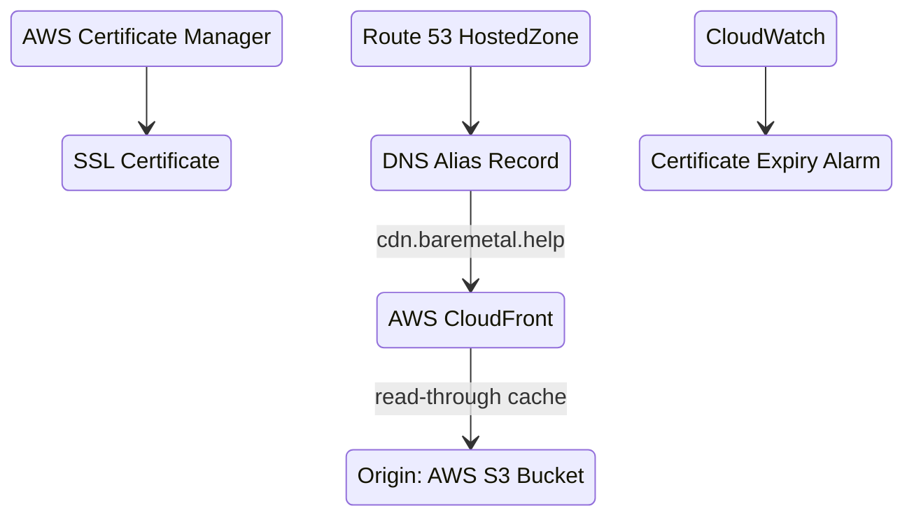
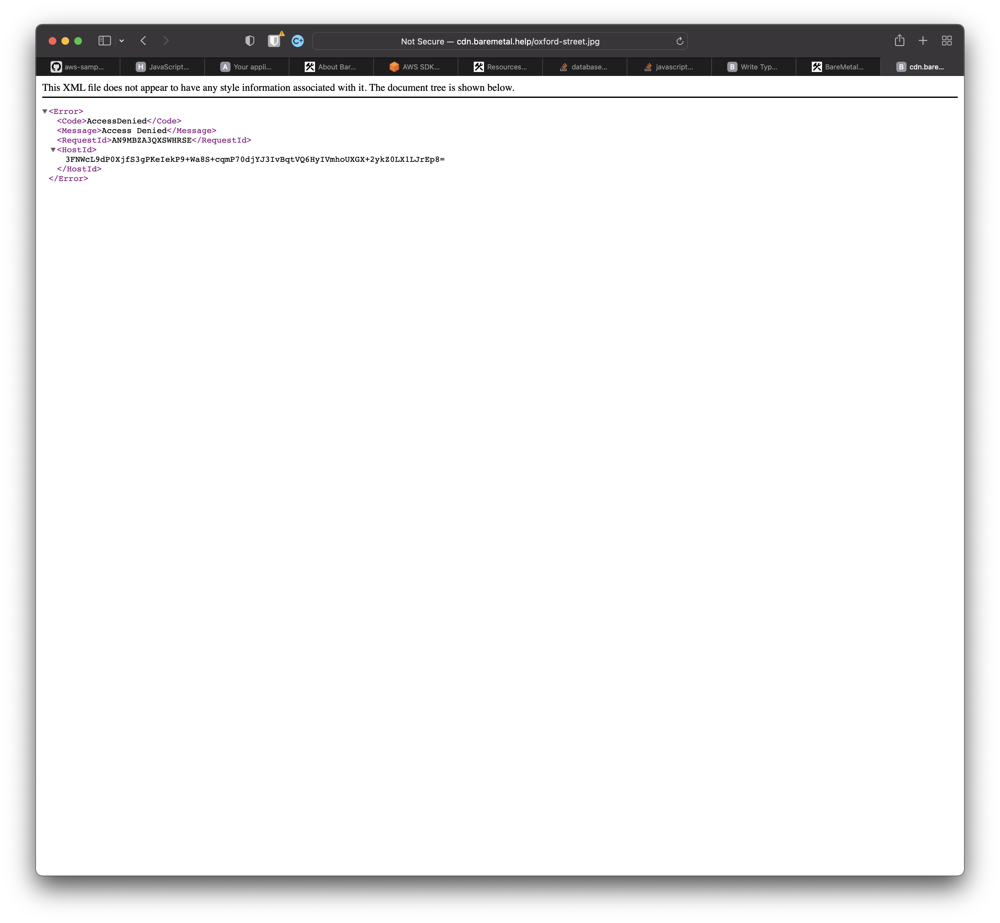

```mdx-code-block
import BrowserWindow from '@site/src/components/BrowserWindow';
import Tabs from '@theme/Tabs';
import TabItem from '@theme/TabItem';
```

# BareMetal CDN

We're going to build a Content Delivery Network, CDN, from scratch. A CDN serves web objects like images from locations that are geographically close to consumers. That means better latency for users and less load on your resources. It's a very common pattern.

CDNs cache too. So you only need to copy the original to one place (the _origin_) and the CDN takes care of copying to edge locations on a cache miss. Origin is an S3 Bucket, but could be an API.

You'll need
- This repo, https://github.com/baremetalhelp/baremetal.help
- [CDK CLI](https://docs.aws.amazon.com/cdk/v2/guide/getting_started.html) and credentials
- [CDK bootstrap](https://docs.aws.amazon.com/cdk/v2/guide/bootstrapping.html) in your AWS account

## Quick Start

Add configuration to `config/common-config.ts`.

```ts
const bareMetalConfig: BareMetalConfig = {
  domainName: "example.com",
  cdnEndpoint: "cdn.example.com",
};
```

Deploy `cdk deploy BareMetalCdn`.

## Architecture



## Assumptions

See the [overall assumptions in "About BareMetal Tutorials"](intro#overall-assumptions).

In addition
1. You registered a domain (strongly recommended). There are more places to register domains than you can count. Here's [how to do that on AWS](https://docs.aws.amazon.com/Route53/latest/DeveloperGuide/domain-register.html). Things will go much more smoothly if you use AWS as your registrar, because the CDN stack as-is will add DNS records for the SSL certificate automatically in AWS. And you need to do that to prove you own the domain you're creating the SSL certificate for.
2. You have content — like images and CSS — you want to serve to web applications or mobile apps.

:::note
You can serve content from an internal HTTP endpoint without a domain you own, but the URL of that endpoint can change if you delete and recreate the CDN.

If you write applications that rely on the internal URL, you'll have to change them.
It's an random internal name created for you by AWS.

If you just want to play with a CDN or don't have a custom domain, your best bet is to use the [AWS console](https://aws.amazon.com/cloudfront/) directly rather than deploy the stack for this tutorial.
:::

In this repo at the top level, run this to see a list of all the BareMetal stacks.

```bash
cdk ls
```

`BareMetalCdn` is the stack for this tutorial. You'll deploy that in a bit.

## Required Configuration

The CDN stack requires the following configuration.

In `config/common-config.ts`, change the common configuration values to your domain. Provide the apex domain for publishing documentation and finding the DNS records. Provide the full hostname for the CDN.

```ts
const bareMetalConfig: BareMetalConfig = {
  domainName: "example.com",
  cdnEndpoint: "cdn.example.com",
};
```

## Deploy

```bash
cdk deploy BareMetalCdn
```

It'll take a little time because setting up a CDN means configuring edge locations.

## Resources

The stack created the following resources.

| Resource | AWS Resource Type | Description |
| --- | --- | --- |
| DNS A record | `AWS::Route53::RecordSet` | The entry in the `HostedZone` for the apex domain you configured. |
| SSL certificate | `AWS::CertificateManager::Certificate` | The SSL certificate you created for the CDN hostname. |
| Cloudwatch alarm | `AWS::CloudWatch::Alarm` | Notification before the certificate expires. |
| Content Delivery Network | `AWS::CloudFront::Distribution` | Configuration for edge locations, origin, rules. | 
| S3 Bucket | `AWS::S3::Bucket` | The origin. This is where you copy images, CSS, JS and the like so that it will appear at edge locations. |
| S3 Bucket origin policy | AWS::S3::BucketPolicy | A cheeky policy on the bucket that protects access to objects in the bucket even if they're public. It does this by restricting access via a CloudFront user principal.

## Verification and Usage

Easy.

:::info action
Copy an asset like an image to the Bucket.

You can do this via the [AWS CLI](https://awscli.amazonaws.com/v2/documentation/api/latest/reference/s3/cp.html#examples).
:::

Paths in the S3 Bucket are honored, so you append the full path of the S3 Object to the CDN endpoint.

For example, if you copied the image `abbey-road.jpg` to the root location in S3, that image is `http://cdn.baremetal.help/abbey-road.jpg` without a path. Those are musicians from my home planet, London.


Error messages for missing assets are obnoxious XML. But at least you get a [403 HTTP](https://developer.mozilla.org/en-US/docs/Web/HTTP/Status/403) status. 



