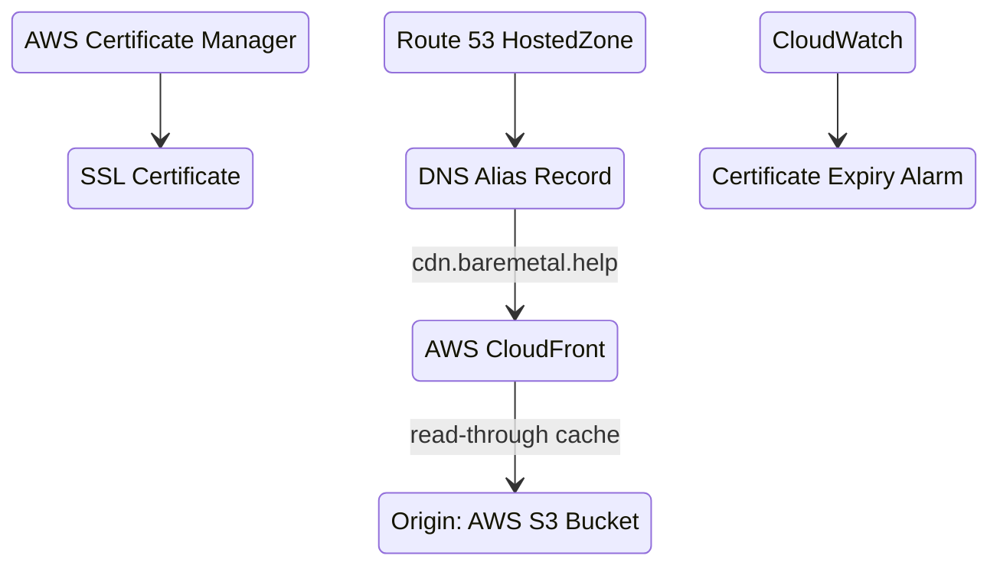

# BareMetal CDN

We're going to build a Content Delivery Network, CDN, from scratch. A CDN serves web objects like images from locations that are geographically close to consumers. That means better latency for users and less load on your resources. It's a very common pattern.

CDNs cache too. So you only need to copy the original to one place (the _origin_) and the CDN takes care of copying to edge locations on a cache miss. Origin is an S3 Bucket, but could be an API.

## Architecture



## Assumptions

See the [overall assumptions in "About BareMetal Tutorials"](intro#overall-assumptions).

In addition
1. You registered a domain (strongly recommended). There are more places to register domains than you can count. Here's [how to do that on AWS](https://docs.aws.amazon.com/Route53/latest/DeveloperGuide/domain-register.html). Things will go much more smoothly if you use AWS as your registrar, because the CDN stack as-is will add DNS records for the SSL certificate automatically in AWS. And you need to do that to prove you own the domain you're creating the SSL certificate for.
2. You have content — like images and CSS — you want to serve to web applications or mobile apps.

:::note
You can serve content from an internal HTTP endpoint without a domain you own, but the URL of that endpoint can change if you delete and recreate the CDN.

If you write applications that rely on the internal URL, you'll have to change them.
It's an random internal name created for you by AWS.

If you just want to play with a CDN or don't have a custom domain, your best bet is to use the [AWS console](https://aws.amazon.com/cloudfront/) directly rather than deploy the stack for this tutorial.
:::

In this repo at the top level, run this to see a list of all the BareMetal stacks.

```bash
cdk ls
```

`BareMetalCdn` is the stack for this tutorial. You'll deploy that in a bit.

## Required Configuration

The CDN stack requires the following configuration.

In `config/common-config.ts`, change the common configuration values to your domain. With the current version, the apex domain for publishing documentation.

```ts
const bareMetalConfig: BareMetalConfig = {
  domainName: "example.com",
  cdnEndpoint: "cdn.example.com",
};
```

## Deploy

```bash
cdk deploy BareMetalCdn
```

## Resources

Blah.

## Verification

Blah.

