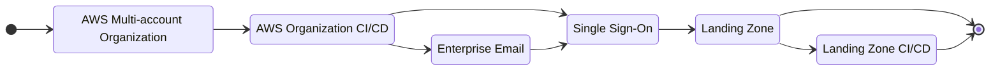
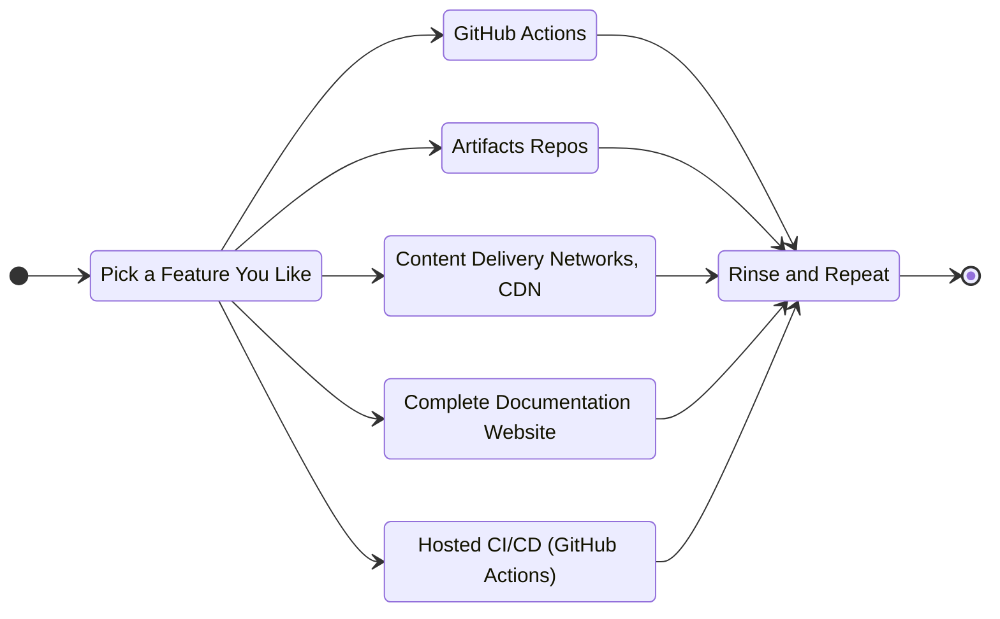

# About BareMetal Tutorials

What is bare metal? It's what computer people often say when they mean a computer with nothing installed on it.

Here are some tutorials for bringing up cloud infrastructure from exactly that, bare metal. We assume very little. The focus here is Amazon Web Services, AWS.

For example, to create a Single Sign-On integration in AWS, we do not assume you have an organization, an existing SSO integration, or a directory set up for users and groups. Or even an AWS account. We're clear about any assumptions and we always show you how to prepare for each tutorial. 

:::info action
Clicks, input, and other actions look like this.

In the left menu, ✅ means the tutorial is complete. ⏲ means it'll be ready shortly.
:::

## A Quick Example

We mean it when we say we give you infrastructure-as-code for all the things. Not only that, we imbue them with secure-by-default best practices and convenience you'll like. For example, here's the infra-as-code (this happens to be written in TypeScript using [AWS Cloud Development Kit, CDK](https://aws.amazon.com/cdk/)) for your Content Delivery Network, CDN.

```ts
    ...
    // Find the AWS DNS entry for your domain
    const hostedZone = HostedZone.fromLookup(this, "hosted-zone", {
      domainName,
    });

    // Create an SSL certificate for the CDN endpoint
    const certificate = new Certificate(this, "certificate", {
      domainName: cdnEndpoint,
      validation: CertificateValidation.fromDns(hostedZone),
    });
    // Set expiry notification
    certificate
      .metricDaysToExpiry()
      .createAlarm(this, "certificate-expiry-alarm", {
        comparisonOperator: ComparisonOperator.LESS_THAN_THRESHOLD,
        evaluationPeriods: 1,
        threshold: 45, // Automatic rotation happens between 60 and 45 days before expiry
      });

    // This is the CDN origin, where you copy resources
    const origin = new Bucket(this, "origin");

    // And finally pull everything together and make the CDN itself
    const distribution = new Distribution(this, "distribution", {
      domainNames: [cdnEndpoint],
      certificate,
      defaultBehavior: {
        origin: new S3Origin(origin),
      },
    });
    ...
```

Even if you don't speak CDK or the TypeScript language, you may be able to follow along and notice

- Nothing is hard-coded, not even the domain or the CDN domain prefix.
- There's just the right SSL certificate with automatic verification that this is for a domain you own via an AWS HostedZone.
- And we'll let you know in plenty of time _before_ that certificate expires with a custom alert.

## The Tutorials

Here's your tutorial path. You'll typically only run the Enterprise Track once. But you can add as many features
as you like and don't have to do them all at once. 

Each tutorial includes infrastructure-as-code for deploying that tutorial's resources, written in AWS CDK. CDK has "stacks" as a
fundamental that encapsulate a collection of related resources. There's at least one stack for every tutorial.

That means you can run the CDK to create the infrastructure in each tutorial without going through every detail. You might regret that
when things go wrong or you want to know how to use it.

:::note
Clone the GitHub repo for this site, https://github.com/baremetalhelp/baremetal.help .

You're going to need this repo to run any of the code we wrote for the BareMetal Tutorials. This documentation is also in the same repo.
:::

### The enterprise track

You'll run this at most once, preferably in a new, empty AWS Account. You do not actually need
to run these stacks at all. You can do everything in the console or the AWS CLI if you wish. But it's a
big deal if this is done repeatably and consistently, the BareMetal way, because a lot of the features you'll be adding in the features track rely on this stuff being set up right.



### The features track

You can run as many of these as you want and do not have to create all the features at once. The same thing goes here
as did for the enterprise BareMetal stacks. You do not actually have to do this using the infra-as-code code here.
But you'll get sad if you don't make it consistent and repeatable.



## Other Approaches

People have been creating Public Cloud infrastructure for as long as it's been around. There are lots of ways to do it. BareMetal is but just one way of many. Here are some examples.

:::warning
This table is wrong and incomplete. It's also biased heavily on the capabilities of BareMetal rather than things it can't do.
:::

| Tooling                                                                                                      | Framework? | Infrastructure-as-Code | Data Driven | CI/CD | SSO Landing Zone | SSO Permissions | AWS Organization | AWS Accounts | Data-Driven | GitHub Pages Website | GitHub Integration |
| ------------------------------------------------------------------------------------------------------------ | ---------- | ---------------------- | ----------- | ----- | ---------------- | --------------- | ---------------- | ------------ | ----------- | -------------------- | ------------------ | --- |
| [AWS Console, 100% Click-Ops](https://aws.amazon.com/console/)                                               |            |                        |             |       | ✅                | ✅               | ✅                | ✅            |             |                      |                    |
| [Cloudformation](https://aws.amazon.com/cloudformation/)                                                     |            | ✅                      |             |       | ✅                | ✅               | ✅                | ✅            |             |                      |                    |
| [AWS CDK](https://aws.amazon.com/cdk/)                                                                       |            | ✅                      |             | ?     | ✅                | ✅               |                  | ✅            |             |                      |                    |
| [Terraform](https://www.terraform.io)                                                                        |            | ✅                      |             |       | ✅                | ✅               | ✅                | ✅            |             |                      |                    |
| [aws-bootstrap-kit](https://github.com/awslabs/aws-bootstrap-kit)                                            | ✅          | ✅                      | ✅           |       | ✅                | ✅               |                  |              |             |                      |                    |     |
| [org-formation](https://github.com/org-formation/org-formation-cli)                                          | ✅          | ✅                      | ✅           | ✅     | ✅                |                 | ✅                | ✅            | ✅           |                      |                    |
| [BareMetal Help](https://baremetal.help)                                                                     | ✅          | ✅                      | ✅           | ✅     | ✅                | ✅               | ✅                | ✅            | ✅           | ✅                    | ✅                  |
| [Account Factory for Terraform](https://docs.aws.amazon.com/controltower/latest/userguide/aft-overview.html) | ✅          | ✅                      | ✅           | ?     | ✅                |                 | ✅                | ✅            | ?           |                      |                    |

## Available BareMetal tutorials

We're adding more all the time. So please check back often to see what's new.

| BareMetal Stack                              | What and How                                                                                                                                                                                                                                                                                                                                                                                                                                                                                            | Resources                                                                                                                                                                                                  |
| -------------------------------------------- | ------------------------------------------------------------------------------------------------------------------------------------------------------------------------------------------------------------------------------------------------------------------------------------------------------------------------------------------------------------------------------------------------------------------------------------------------------------------------------------------------------- | ---------------------------------------------------------------------------------------------------------------------------------------------------------------------------------------------------------- |
| Content Delivery Network, CDN                | You use a CDN to make things like images available at "edge locations" so that people on your website can get those images — sometimes large — from an internet data center near them. It's quicker.                                                                                                                                                                                                                                                                                                    | [Wikipedia CDN](https://en.wikipedia.org/wiki/Content_delivery_network), [AWS CloudFront](https://aws.amazon.com/cloudfront/)                                                                              |
| A documentation website, like this one       | Using [Markdown](https://docusaurus.io/docs/markdown-features) and a few tools, you'll be able to create a website just like this one. We have infra-as-code for setting up free hosting on [GitHub Pages](https://pages.github.com/), which is free even for moderate volume. You can deploy the documentation at your apex domain, just like we did here at https://baremetal.help . We have [GitHub Actions](https://github.com/features/actions) for deploying documentation updates automatically. | [Docusaurus](https://docusaurus.io/), [Markdown](https://docusaurus.io/docs/markdown-features)                                                                                                             |
| An Enterprise AWS Organization               | You'll need this to manage multiple accounts effectively. For Production, Pre-production, and Development, for example.                                                                                                                                                                                                                                                                                                                                                                                 | [AWS Organizations](https://aws.amazon.com/organizations/), [AWS ControlTower](https://aws.amazon.com/controltower/?control-blogs.sort-by=item.additionalFields.createdDate&control-blogs.sort-order=desc) |
| Single Sign-On                               | We show how to build an enterprise-grade Single Sign-On infrastructure from scratch. You'll use a user/group directory — probably on Azure AD — and an SSO implementation on AWS that connects to it. This is what your enterprise grade SSO looks like.                                                                                                                                                                                                                                                | [Azure Active Directory](https://azure.microsoft.com/en-us/services/active-directory/), [AWS SSO](https://aws.amazon.com/single-sign-on/)                                                                  |
| Artifact Repos                               | You'll probably want to control access to public repos for package managers, where you can approve and audit packages for external sources. There are repo configurations for npm, pip, yarn, twine, Maven, and NuGet. There's a stack you can run that creates these repos with pull-through caching and the right configuration.                                                                                                                                                                      | [AWS CodeArtifact](https://aws.amazon.com/codeartifact/)                                                                                                                                                   |
| GitHub Actions [links to this and above too] |
| Enterprise email                             |

## Nothing Special

There's already so much great documentation for all of the resources you can create in the public cloud. We don't duplicate it, and will cheerfully link to the best documentation along the way.

What we _do_ provide, however, is infrastructure-as-code stacks for all the enterprise-grade infrastructure that you need to being up in bare metal that share common configuration and written in a way so
you can pick and chose what you want. The common configuration means that all your BareMetal stacks are consistent and compatible.

We make it super clear when there are dependencies on other tutorials.

## Overall Assumptions

Here are the basics. Each tutorial relies on at least these. Additional requirements are listed in each tutorial as needed.

1. You have an AWS account and have [created a privileged IAM user](https://docs.aws.amazon.com/IAM/latest/UserGuide/getting-started_create-admin-group.html), `admin`.
2. You have [created credentials for the `admin` user] and have [stored them on your computer](https://docs.aws.amazon.com/cli/latest/userguide/cli-configure-files.html).
3. You have installed the [latest AWS command-ine tools, CLI](https://docs.aws.amazon.com/cli/latest/userguide/getting-started-install.html).
4. You have installed the [latest AWS CDK CLI](https://docs.aws.amazon.com/cdk/v2/guide/getting_started.html).

## Verify Your Setup

Blah.

## Shared Configuration

We make it easy to define common configuration used across all stacks. That way everything's consistent.

We're defining infrastructure-as-code for everything. So all the configuration data you need is in code. We like the TypeScript language, but we could have used any of the [supported CDK languages](https://aws.amazon.com/cdk/faqs/#:~:text=Q%3A%20What%20programming%20languages%20does,Go%20(in%20Developer%20Preview).).

In the file `./config/common-config.ts`, you can see

```ts
const bareMetalConfig: BareMetalConfig = {
    ssoInstanceArn: "arn:aws:sso:::instance/ssoins-722394f61090d7d4",
    ssoRegion: "us-east-1",
    domainName: "baremetal.help",
    cdnEndpoint: "cdn.baremetal.help",
    gitHubUser: "baremetalhelp",
};
```

All fields are optional. Here's what each field does.

| Field            | Value                                                                                                                                  |
| ---------------- | -------------------------------------------------------------------------------------------------------------------------------------- |
| `ssoInstanceArn` | If you're using Single Sign-On, you'll have this value handy. This is used to create permissions for users using the SSO Landing Zone. |
| `ssoRegion`      | This is the region of SSO, not necessarily the region you're using for your BareMetal stacks.                                          |
| `domainName`     | If you have a domain you want to use for documentation, add this value.                                                                |
| `cdnEndpoint`    | If you're developing a CDN, add this field,                                                                                            |
| `gitHubUser`     | For publishing documentation.                                                                                                          |

## Consistent and Universal Resource Tagging

Resource tagging is at the very core of Public Cloud best practices. Again in `./config/common-config.ts`, edit `globalTags` key/value tags. Your Organization creates a custom policy for required tags and values. For example, departmental charge back requires consistent tagging.

Here's the tags we use. But your enterprise will want more as a best practice, including 

```ts
export const globalTags: { [key: string]: any } = {
    repo: "https://github.com/baremetalhelp/baremetal.help",
    owner: "tech@baremetal.help",
    environment: "dev",
    description: "Infra-as-Code and documentation for a robust cloud-native enterprise foundation",
};
```

## To-Do

- [x] Make all configuration fields optional and handle them
- [ ] Each tutorial must have at least the following sections: preamble with resource diagram "Assumptions", "Required Configuration", "How to Deploy", "Verification", "Stack Resources" as table, "How it works", 
- [ ] Add all the links
- [ ] Comments in CDK and data structures
- [ ] Separate CDN prefix for domain name
- [ ] Add switch for domain verification for SSL Certificate if the domain is not hosted in AWS Route 53 
- [ ] Pass SSO region to custom resource handlers
- [ ] Create and use config for GitHub Pages IP addresses
- [ ] Create and apply SCP for required tags and values
- [ ] Create Enterprise track and Features track in top-level doc sidebar menu
- [ ] Fix doc links. Sometimes we copied the URL from `http://localhost:3000`
- [ ] Test whether an empty Managed Services list in Permission Sets work. Otherwise do the same as missing policy. I don't think it's an error to have both missing because we could just be setting things up.
- [ ] Explore making true constructs for the meat of stacks, even if they're only used once in BareMetal
- [x] Use title case for H1 _and_ H2 b/c H2 are document headings, sentence case for everything else
- [ ] Open source goodness like licensing, semantic versioning, PR template, ...
- [ ] GitHub Actions for stack (hooks per stack if possible)
- [ ] Maybe move common config back to top-level and pass explicitly to stacks? Yeah. I think that's right.
- [ ] Alt text for images
- [ ] Do we need custom domain for AD Tenant?
- [ ] Clarify potential issues and fixes for each step 
- [ ] Clarify and be super explicit about the P2 trial license
- [ ] Dependency diagram for the enterprise track is wrong: It should reflect options and dependencies better
- [ ] Describe what exactly ControlTower is and how to operate it. This should include default SCPs and examples of creating our own.
- [ ] Still with CT, show best practices for managing accounts. AFT?
- [ ] Show how to configure CLI access via AWS config for SSO
- [ ] Create reusable CDK Constructs for common components and publish them separately. Check again whether that's already been done and leverage those if they're any good.
- [ ] And when you do that, make them take, for example, either an existing bucket or a bucket configuration for a new one. Better still in that case, pass an existing origin like `S3Origin` instead of the bucket. Otherwise the default will be a bucket configured as origin. I like that better.
- [ ] Set up billing alarms from day 1.

:::note
BareMetal is not really a trademark. But "BareMetal is not really a trademark™" is.
:::
