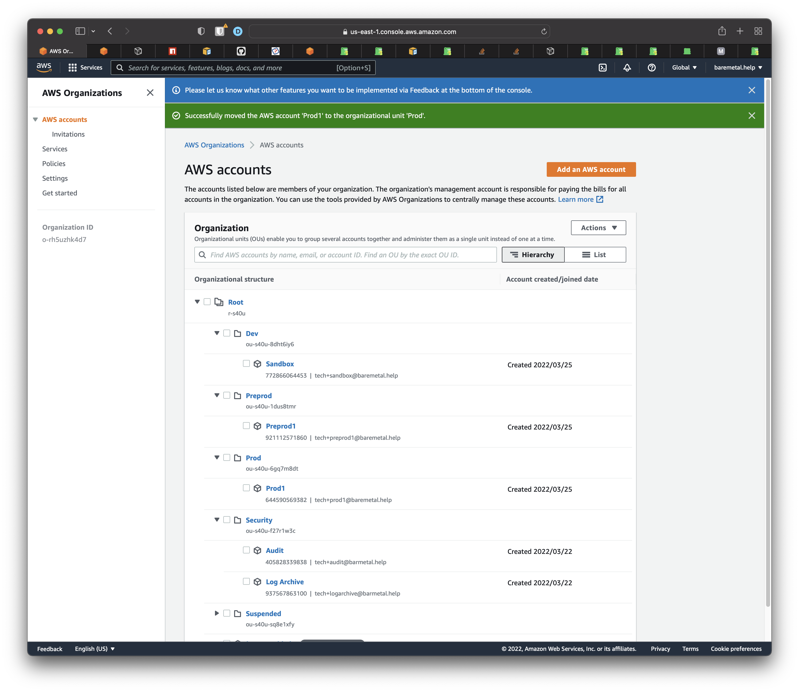

# SSO Landing Zone 

Single Sign-On provides a way to associate users and groups in the enterprise. Usually, this delegates to something like Active Directory.

But there's another piece that must be implemented that lets users see accounts and permissions for groups they're in once they sign on. This is done with [AWS Permission Sets](https://docs.aws.amazon.com/singlesignon/latest/userguide/permissionsetsconcept.html). That's what you're going to do now.

Unless you do this bit, users will be able to log in using SSO just fine, but they won't see any available accounts when they do. 

Here's how the different entities are related. Looks complicated, but follow it through anyway.


## Assumptions

See the general assumptions in "About BareMetal tutorials".

In addition
1. You have set up a [BareMetal AWS Organization](../docs/organization)
2. You have created some accounts in the organization
3. You have SSO integration ready because you [followed the instructions](../docs/sso/follow-instructions) or [looked at the pictures](../docs/sso/sso-picture-book)

## Preparation

The CDK stack for the Landing Zone is data-driven. This means we made it easy for you create assignments of SSO groups to accounts. SSO users in those groups will see accounts assigned to the groups they're in when they log in. This is the Landing Zone.

You're going to collect ids for AWS Accounts and SSO Groups an add those to a data structure. The CDK stack will traverse this data structure and create the corresponding AWS resources for the Landing Zone. We do the loops and create the resources so you don't have to.

A big advantage of making this part data driven is that since we're using TypeScript, we can make the data type safe so you don't mess it up. And you don't have to worry about all the plumbing. All you need to do it gather the rights ids.

The configuration file ig `landing-zone-config.ts` [link].

In summary, you'll
1. Make a list of AWS Accounts
2. Make a list of SSO Groups
3. Define AWS Permission Sets that grant SSO Users in SSO Groups permissions in AWS Accounts
4. Press the "go" button

### Get the list of AWS Accounts

Open the AWS console to the AWS Organizations page. Open up the tree of Organization Units. Any accounts present in the Organization will appear here. For example



shows account names and numbers.

For each AWS account you want to include in the Landing Zone, add a value to the `enum Account` like this.

```ts
export enum Account {
    BILLING_ACCOUNT = "825617765789",
    SANDBOX = "772866064453",
    PREPROD1 = "921112571860",
    PROD1 = "644590569382",
    AUDIT = "405828339838",
    LOG_ARCHIVE = "937567863100",
}
```

An `enum` is better than constants because we can use them in type-safe data structures. Remember these are strings.[^1]

### Get the list of SSO Group IDs

Open the AWS SSO Console. Click _Groups_. Click a group you want to available in the Landing Zone. Copy the _Group ID_. These ids are GUIDs with a prefix.


Now update the `enum` for SSO Groups, just like you did for AWS Accounts.

```ts
export enum Group {
    ADMINISTRATOR = "9067420728-45df392d-85da-4751-9f20-47fb268d3709",
    VIEW_ONLY = "9067420728-101bc3b4-7cbc-4b31-9bfe-4a50632d72b8",
    READ_ONLY = "9067420728-b8b4d794-4d00-4b87-a1b2-7c58ca76c3a2",
    DEVELOPER = "9067420728-e78cfac1-937f-459a-98f7-1a4fe90b5772",
}
```

### Configure permissions

Each SSO Group can be assigned to multiple AWS Accounts. And for each assignment, you need to specify the permissions an SSO User in that SSO Group will have in each account.

There's a data structure.

```ts
export interface PermissionSetConfig {
    name: string;
    awsManagedPolicyNames?: string[];
    inlinePolicyStatements?: PolicyStatement[];
}
```

Here's the Administrator Permission Set config, defined in `permission-sets.ts` [link]

```ts
export const adminPermissionSetConfig: PermissionSetConfig = {
    name: "ADMINISTRATOR",
    awsManagedPolicyNames: [ManagedPolicies.ADMINISTRATOR_ACCESS],
};
```

`name` has to be unique. We're using upper case but that's just a habit.

`awsManagedPolicyNames` is an array of `string`s that correspond to AWS-provided policies. We're using the JavaScript library `cdk-constants`, which makes it easy not to mess up spelling.

In the above, the `inlinePolicy` was omitted. We'll make a Permission Set in a bit that has an inline policy so you can see what that's about.

Define as many of these as you have roles, job functions, or however else you plan to administer access.

## Now glue everything together

In the file `landing-zone-config.ts`, see the interface `GroupAssignment`

```ts
interface GroupAssignment {
    group: Group;
    accounts: Account[];
    permissionSetConfig: PermissionSetConfig;
}
```

We define data in this structure that binds everything together.

Add elements to the `landingZoneConfig` like this

```ts
export const landingZoneConfig: GroupAssignment[] = [
    // Administrator
    //
    {
        group: Group.ADMINISTRATOR,
        accounts: [
            Account.BILLING_ACCOUNT,
            Account.SANDBOX,
            Account.PREPROD1,
            Account.PROD1,
            Account.AUDIT,
            Account.LOG_ARCHIVE,
        ],
        permissionSetConfig: adminPermissionSetConfig,
    },
    ...
```

Here, `group` is a value from your `enum` for SSO Groups. `accounts` is an array that defines which AWS Accounts in the Landing Zone will be available for this SSO Group.

And `permissionSetConfig` is the permissions you defined previously. You can define this permission configuration inline like this if you want.

```ts
 {
        group: Group.ADMINISTRATOR,
        accounts: [
            Account.BILLING_ACCOUNT,
            Account.SANDBOX,
            Account.PREPROD1,
            Account.PROD1,
            Account.AUDIT,
            Account.LOG_ARCHIVE,
        ],
        permissionSetConfig: {
            name: "ADMINISTRATOR",
            awsManagedPolicyNames: [ManagedPolicies.ADMINISTRATOR_ACCESS],
        },
    },
```

## Deploy the SSO stack

Blah

```bash
cdk --profile baremetal.help --region us-east-1 deploy BareMetalLandingZone
```

Blah

## Behind the scenes

Blah

## Resources

Blah.

## Verification

Blah.

[^1] Perhaps we could have used numbers here, but we're not sure how good AWS is at not starting account numbers with `0`.
