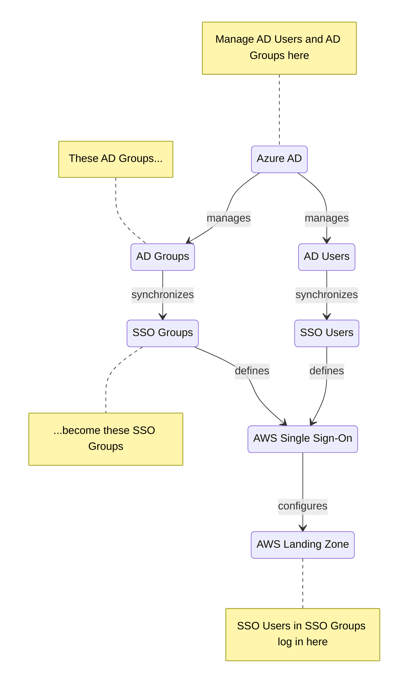

# The Big Picture

We're going to configure AWS Single Sign-On to talk to Azure AD. You'll need a directory for any company, and integrating that with AWS SSO is a great way to give users secure access to AWS via an AWS Landing Zone.

## Architecture

You'll use the Azure AD console to administer your users and groups. And AD will be where you manage users and groups. In fact, it's the only place because AWS SSO has a single _Identity Provider_ [link], which disables managing user and groups from the AWS Console. 

## Getting the Terminology Right

So many different kinds of Users and Groups. I'm confused.

That's because it's confusing.

- **Azure** is the Microsoft Public Cloud.
- **Azure AD** is the Active Directory managed service in Azure.
- An **Azure AD Tenant** is a separate Active Directory instance.
- An **AD User** is a user in your enterprise who probably belongs to several **AD Groups**. You manage AD Users and AD Groups in AD, your enterprise directory.
- **AWS Single Sign-On, SSO** is the AWS service that allows users in your organization to log in to AWS accounts with permissions you define.
- An **SSO User** and an **SSO Group** are AWS entities that are used by AWS SSO.
- **AD Provisioning** is the process that synchronizes AD Users and Groups to AWS SSO Users and Groups.
- When an SSO User logs in, the **AWS Landing Zone** webpage shows the AWS Accounts they have access to and the roles they can assume in each.
- **Assignment** configures which AD Users and Groups are provisioned.
- **AWS IAM Users** and **AWS IAM Groups** are internal to AWS and are not used for SSO. In fact, the only place BareMetal uses an IAM User is to create credentials for running command-line tools.

Clearer? Just remember that AD, AWS SSO, and AWS IAM each have their own definitions of users and groups. AD synchronizes Users and Groups to AWS SSO.

## Assumptions

See the general assumptions in "About BareMetal tutorials".

In addition
1. You have an Azure account [link]
2. ...

## Required Configuration

1. Blah

## Deploy 

Blah.

## Resources

Blah.

## Verification

Blah.
