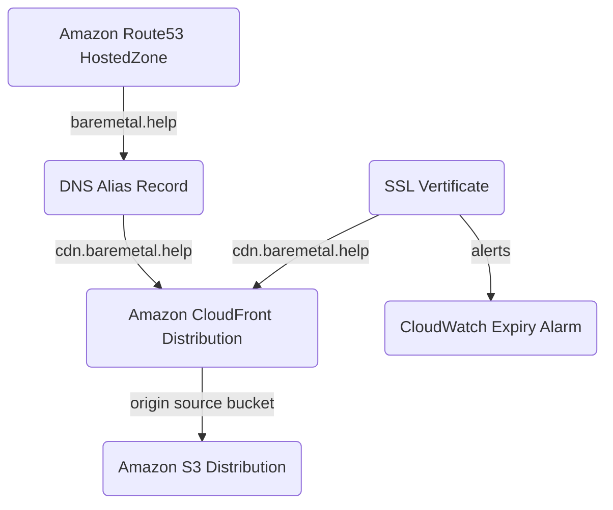
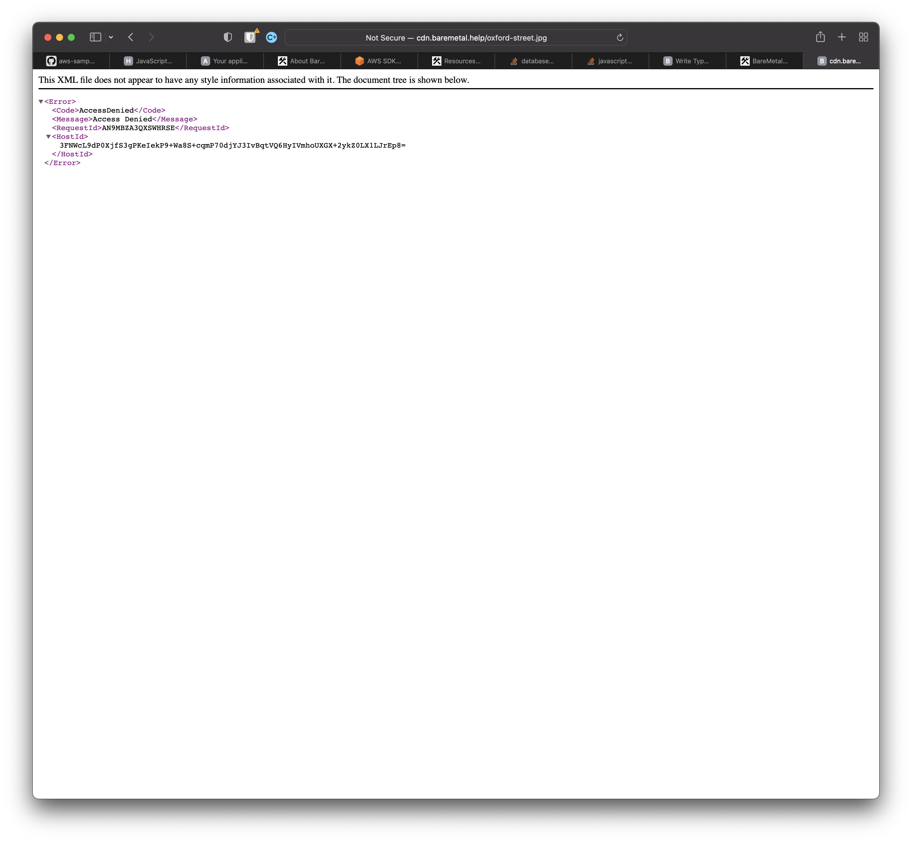

# Content Delivery Network, CDN

We're going to build a Content Delivery Network, CDN, from scratch. A CDN serves web objects like images from locations that are geographically close to consumers. That means improved latency for users and less load on your resources because the CDN serves objects on your behalf. It's a very common pattern.

A CDN is at its core a read-through cache. You configure where your images and so on reside — the _origin_ — and the CDN takes care of copying them to edge locations. Edge locations are data centers that are distributed across the world, and your requests are directed to one close you whenever you want to load assets like images in a web page. Latency and bandwidth are probably better if you load it from somewhere close.

If the requested image is not yet available on a given edge location, it will be fetched from your origin. Origin is an S3 Bucket in the one we're going to build, but could also be an API. If an asset is requested that does not exists at the origin, the CDN will return an HTTP 404, Not Found and cache the response. Again, to reduce the burden on your origin.

You can do clever things like [adding compute to scale images](https://aws.amazon.com/blogs/networking-and-content-delivery/resizing-images-with-amazon-cloudfront-lambdaedge-aws-cdn-blog/), for example, in Amazon Cloudfront, but we're going to keep things simple here.

## Quick Start

If you've done this kind of thing before.

Edit `bin/baremetal.help.ts` in the repo root and set `domainName` to your domain. We're using `baremetal.help` because that's our domain. You can't have that domain unless you offer us enough money. I mean, everything has a price. So use your own or [get one](https://docs.aws.amazon.com/Route53/latest/DeveloperGuide/domain-register.html).

```ts
const domainName = "baremetal.help";
```

Deploy

```shell
cdk deploy BareMetalCdn
```

You can now serve images from the S3 bucket created by the stack at `https://cdn.baremetal.help`.

If that didn't work, keep reading.

## Architecture



## Assumptions

In addition

1. You registered a domain. This is not going to work without it. There are more places to register domains than you can count. Here's [how to do that on AWS](https://docs.aws.amazon.com/Route53/latest/DeveloperGuide/domain-register.html). Things will go much more smoothly if you use AWS as your registrar, because the CDN stack as-is will add the relevant DNS records automatically in AWS. And you need to do that to prove you own the domain you're creating the SSL certificate for. In addition, the SSL certificate requires domain validation — that you actually own the domain — which can be automated if you use AWS as your Domain Registrar.
2. You have content — like images and CSS — you want to serve to web applications or mobile apps. Or just some test images for now.

:::note best-practice
You can serve content from the internal HTTPS endpoint Cloudfront provides without linking a domain you own, but the URL of that endpoint will change if you delete and recreate the CDN.

If you write applications that rely on the Cloudfront internal URL, you'll have a lot to update when you get a new one.

If you just want to play with a CDN or don't have a custom domain, your best bet is to use the [AWS console](https://aws.amazon.com/cloudfront/) directly rather than deploy the stack for this tutorial.
:::

## Deploy a CDN

In the file `baremetal.help.ts` in the repo root, update `domainName` to a domain you own. BareMetal owns `baremetal.help`, so we'll use that one.

```ts
const domainName = "baremetal.help";
```

In this repo at the top level, run this to see a list of all the BareMetal stacks.

```bash
cdk ls
```

`BareMetalCdn` is the stack you're looking for.

```bash
cdk deploy BareMetalCdn
```

It'll take soe time because setting up a CDN means configuring edge locations. Edge locations are the data centers around the world that will serve your images without retrieving it from your S3 bucket every time.

## Verification and Usage

Easy.

:::info action
Copy an asset like an image to the Bucket.

You can do this via the [AWS CLI](https://awscli.amazonaws.com/v2/documentation/api/latest/reference/s3/cp.html#examples).
:::

Paths in the S3 Bucket are honored, so you append the full path of the S3 Object to the CDN endpoint.

For example, if you copied an image of Abbey Road to the root location in S3, that image is available in the CDN `http://cdn.baremetal.help/abbey-road.jpg` without a path. Those are musicians from my home planet, London.


Error messages for missing assets are XML for some reason. But at least you get a [403 HTTP](https://developer.mozilla.org/en-US/docs/Web/HTTP/Status/403) status.



## The upshot

You created a Content Delivery Network where images and other assets you own are distributed across the globe so people can download then efficiently.

You made the CDN your own by giving it a friendly name in a domain you own.
