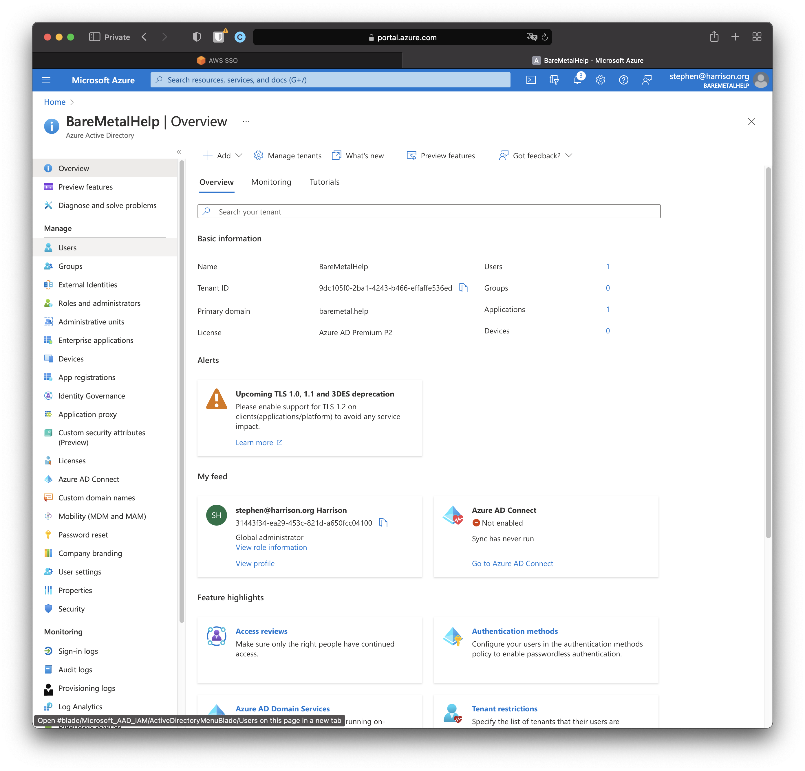
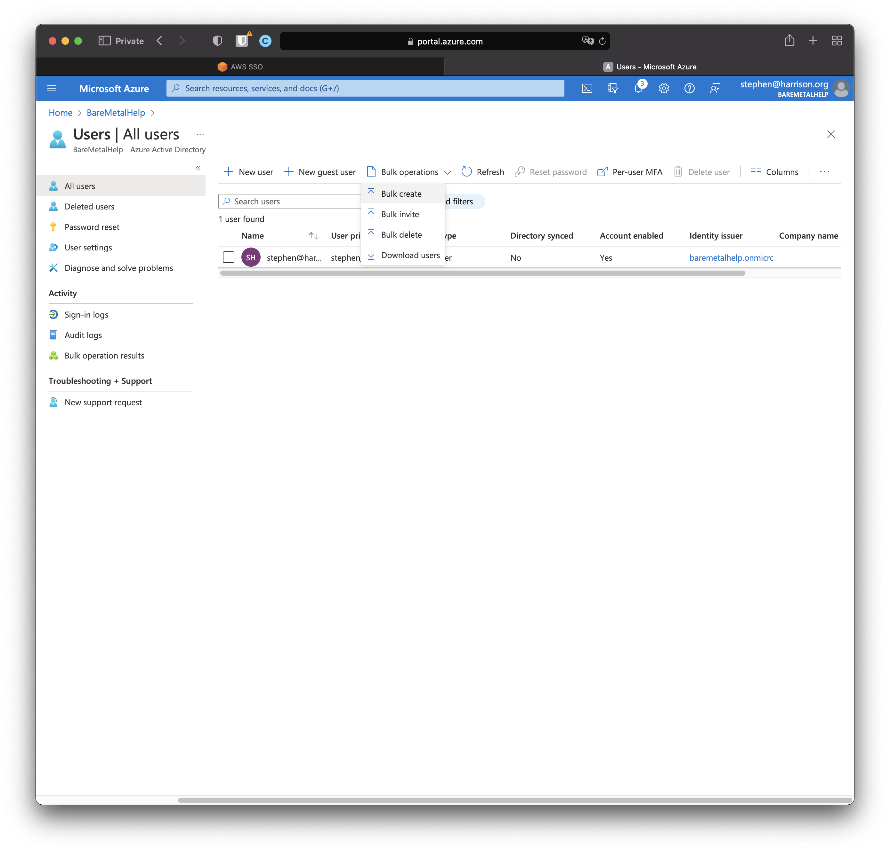
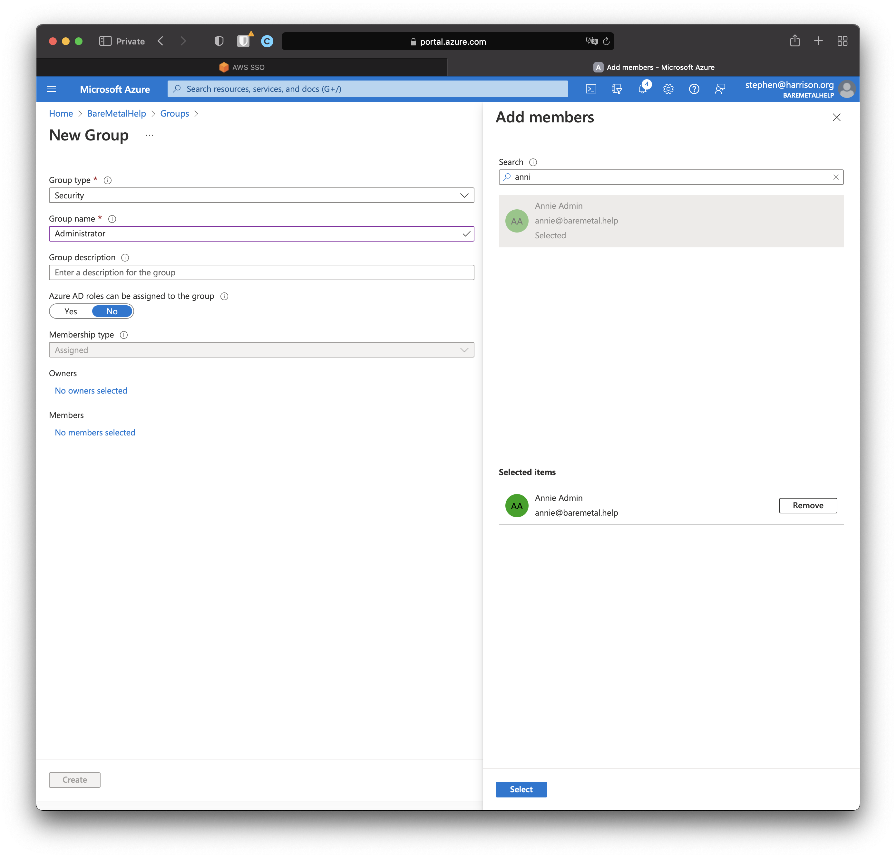
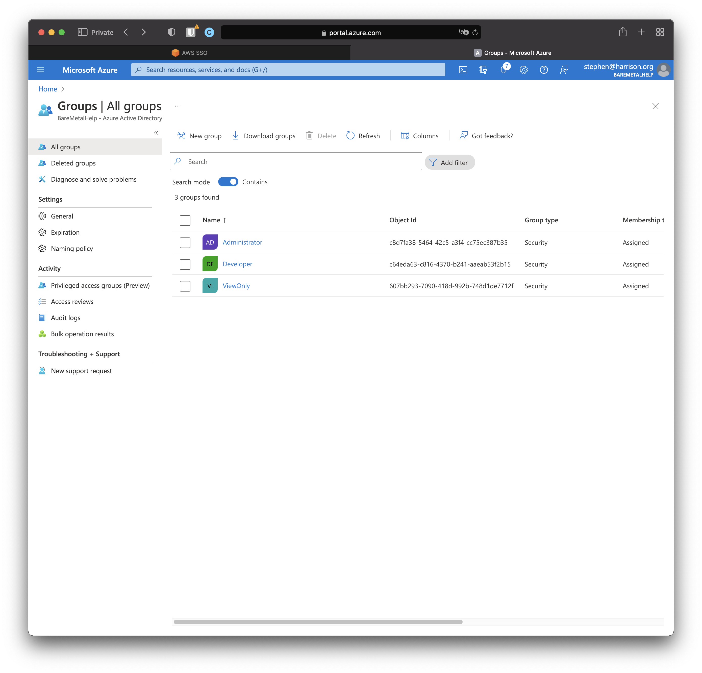

# Set Up Users and Groups

AWS SSO has been set up and configured with Azure AD as the Identity Provider.

It's a bit hard to see whether it works because we don't have a way to test it. There are no users and groups.

And even if we had users and groups, we did not set up the synchronization to AWS SSO. Let's take care of all that now.

Azure AD is how we provision AD Users and AD Groups.

## Create Users Bulk Load Data

Copy and save this CSV file to start you off.

```csv
version:v1.0,,,,,,,,,,,,,,,,
Name [displayName] Required,User name [userPrincipalName] Required,Initial password [passwordProfile] Required,Block sign in (Yes/No) [accountEnabled] Required,First name [givenName],Last name [surname],Job title [jobTitle],Department [department],Usage location [usageLocation],Street address [streetAddress],State or province [state],Country or region [country],Office [physicalDeliveryOfficeName],City [city],ZIP or postal code [postalCode],Office phone [telephoneNumber],Mobile phone [mobile]
Annie Admin,annie@baremetal.help,Secret,No,Annie,Admin,SRE,IT,,,,,,,,,
David Developer,david@baremetal.help,Secret,No,David,Developer,Developer,Engineering,,,,,,,,,
Vickie View-Only,vickie@baremetal.help,Secret,No,Vickie,View-Only,CFO,Finance,,,,,,,,,
```

:::note
The password field here, `Secret`, does not comply with the default password requirements in AD. [link to what this is and how to change it]

We did not add all the available fields. And the users we create will not have all possible attributes.
:::

## Bulk Upload Users 

Open the console for your AD tenant [clarify].



:::info action
Click "Users".
:::



:::info action
Click "Bulk operations". Select "Bulk create".

Load the CSV file you prepared earlier. Click "Submit". Wait a minute or so. Click "Refresh".
:::

We created three users with names that are roles. We will shortly create and assign AD Users to AD Groups.

The next step in AWS SSO is to create permissions for each of those groups and assign those permissions to AWS Accounts.

# Create Some Groups

We'll add a few groups by hand. And when we create a group, we'll add users by hand since we only have a few.



:::info action
Click "Select". Click "Create".
:::

We added three groups with different members. Our "ViewOnly" group includes everyone.



We're done with users and groups. Time for a little more set up to configure which ones get synchronized.
