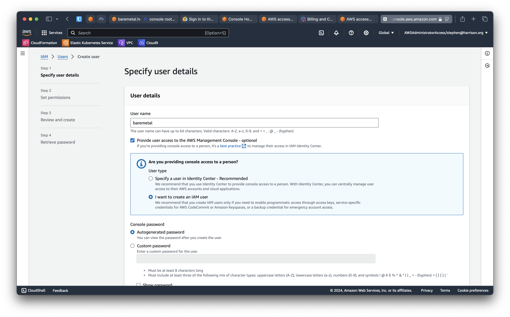

# Set Up your AWS Account

```mdx-code-block
import SecurityCredentials from './images/root-account-settings.png';
import SignOut from './images/sign-out.png';
import MFA from './images/mfa.png';
import MFAsAtLogin from './images/mfas-at-login.png';
```

Creating a new AWS account is easy. Setting it up for best practices like security and billing is also easy, but easy to miss. All the features and functionality of the rest of BareMetal rely on this correct set up.

## Create an AWS account

As mentioned, this part's easy. Follow the instructions in [Sign up for AWS](https://signin.aws.amazon.com/signup?request_type=register). Remember the email address you provided and if you see it, jot down the AWS account number. This new account comes with a generous [Free Tier](https://aws.amazon.com/free). You will still need a credit card.

:::warning Delete resources when you're finished with them!
You can create virtual compute resources, EC2, in the free tier. But that only applies to certain sizes and then only for a limited number of hours in a month.

**If you create an instance or other resource, please make sure you delete it when you're finished. You will incur charges if you leave them running, even if you don't use them.**

S3 buckets are practically free, even for buckets with a lot of objects. But archiving unused S3 objects to deep storage incurs a per-object charge. So it pays to study the cost structure of how AWS changes for things.

No, seriously, delete unused resources. Do it now, while you're thinking of it.
:::

## Log in as the root user

You'll use the email address and password you used to create the AWS Account to [sign in for the first time](https://aws.amazon.com/free/?all-free-tier.sort-by=item.additionalFields.SortRank&all-free-tier.sort-order=asc&awsf.Free%20Tier%20Types=*all&awsf.Free%20Tier%20Categories=*all). This is called the "root" user.

:::warning security
You generally won't use the root user for anything after the original set up. Specifically, you must not create credentials for the root user to use command-line tools.

Simply just having these credentials stored anywhere is a significant threat and will allow an attacker to take over your whole account if they compromise your laptop.

We'll shortly set up a privileged user, and that will required root access to the console only.
:::

## Assign the root user MFA, Multi-Factor Authentication

Once you have logged in as the root user, the very first thing to do is to assign MFA. This is true for all accounts, but setting it for root is critical. If you have a hardware MFA, all the better. But software MFAs are almost as good [^bitwarden].

:::info action
Once you're logged in, from the top-right menu in the AWS console click "Security credentials" for the root user.


:::

You'll see "My security credentials" for the root user.

:::info action
Click "Assign MFA device" and follow along.
:::

Here's what a successfully-assigned MFA device looks like.


### Test the root MFA

:::info action
Click "Sign out" from the top-right menu in the AWS console. 

Then log back in as the root user. This time, the console will prompt for the MFA. [^sequoia] 
:::

:::warning security
You will not need to use the root user frequently, perhaps never again if you're security conscious. Which you definitely are, because you're building a secure-by-default enterprise in the AWS public cloud.
:::

## Establish cost budgets

Any Public Cloud costs money. It's not unusual for big companies to spend $1M+ a month.

:::note a note on pricing
When you migrate from your data center to the cloud, how you pay for infrastructure changes. A lot. Many times we've seen "sticker shock" when the first bill comes in. Maybe you messed up, but Finance in your company will need answers in any case.

The issue is often that people start comparing two completely different ways of paying for things: CapEx vs. OpEx. Read [CapEx Vs. OpEx In The Cloud: 10 Key Differences](https://www.cloudzero.com/blog/capex-vs-opex/) for a good overview.

In brief, CapEx, Capital Expenditure, represents larger upfront costs for hardware where the on-going monthly OpEx, Operation Expenses, are then usually moderate. Hosting, IT staff, and so on. In the Public Cloud, your bill will be OpEx. There are generally no upfront cost requirements and pricing is pay-as-you-use. This often means the cloud monthly bill is much larger than it was in the old model. But the savings comes from the fact you didn't buy lots of infrastructure upfront.

Public Cloud offers exceptional scaling up for peak load and scaling down for periods of lower traffic. In traditional CapEx models, you have to buy enough infrastructure for peak load, which is sitting idle outside that period.
:::

:::info action
Log in as the root user in the AWS console and click _Billing and Cost Management_.
:::

Here you can see a private AWS account with moderate bills.


You can use the [AWS Pricing Calculator](https://calculator.aws/#/) to estimate charges by usage patterns.

See [What is AWS Billing and Cost Management?](https://docs.aws.amazon.com/awsaccountbilling/latest/aboutv2/billing-what-is.html) for an overview [User Guide](https://docs.aws.amazon.com/pricing-calculator/latest/userguide/what-is-pricing-calculator.html).

See [Managing your costs with AWS Budgets](https://docs.aws.amazon.com/cost-management/latest/userguide/budgets-managing-costs.html) for details of how to create budgets and alarms. It's very handy to know you'll get notified if you left something running or your estimates were inaccurate.

See [Create a billing alarm to monitor your estimated AWS charges](https://docs.aws.amazon.com/AmazonCloudWatch/latest/monitoring/monitor_estimated_charges_with_cloudwatch.html) for details of setting up billing alarm.

Here, you can see how two budgets set up for daily and monthly costs in a personal AWS Account. The monthly often goes over because of domain renewal. But you should always check even if you think you know why it spiked. Otherwise you'll have a "There was this one time..." story to tell.


## Create a `poweruser` IAM group

As a security best practice, we group users into user groups. It's more secure this way because it's easier to change and check permissions for a user.

We're intentionally calling this group `poweruser` and not `admin` because there are permissions the power user doesn't have to have, like changing account settings.

:::info action
As the root user in the AWS Console, open the "IAM" console UI. (_Not_ IAM Identity Center.)

In the left panel under "Access management", "User groups", click "Create group". Call the group `poweruser`.
:::


Now we're going at attach two AWS-managed policies, `PowerUserAccess` and `IAMFullAccess`. [^explainpoweruseracess]

:::info action
In the console panel "Attach permissions policies - Optional", search for `poweruseraccess` and check the box.
:::


:::info action
Do the same for `iamfullaccess`.
:::


Complete the create group UI and you'll see


## Create a privileged IAM user `baremetal`

We're going to create a privileged user so we don't have to log in as the root user and especially so we don't have to create and command-line credentials for the root user. This is a _requirement_ for secure AWS accounts.

:::info action
Log in as the root user if needed. With any luck, this will be the last time in a while you'll be logging in as root.
:::

You have a lot of options for creating a privileged IAM user. It's confusing, especially if you're new to this. [Authentication and access credentials](https://docs.aws.amazon.com/cli/latest/userguide/cli-chap-authentication.html) takes you down that rabbit hole.

Or you can follow this short version.

### A short version

:::info action
As the root user in the AWS Console, click IAM. (_Not_ IAM Identity Center.)

Click "Users" on the left panel. Click "Create user". You can choose any combination of password options. We generally recommend forcing users to change on first log in. You can use a secure service like https://flashpaper.io to encrypt and delete the initial credentials.
:::



:::info action
Now add the `baremetal` user to the `poweruser` group we created previously.
:::


You can download credentials or email instructions. In any case, you can make a note of the Console sign-in link. You can use that link to sign in as an IAM user in the specified account.


When you complete the create user UI, this is what you see.


## Log in and secure the `baremetal` user

We got a temporary password, which we will have to change on first login. Let's do that and set up MFA at the same time.

:::info action
Log in as `baremetal` [via the AWS Console](https://aws.amazon.com/console/).
:::

Or you can use Console sign-in link if you copied it. It will fill out the account number or alias. Your AWS account number is the one you wrote down when you created the account, right? If you don't know it, you can log in as the root user and see it in the top-right menu in the console.

| First Login                   | Change Password                   |
| ----------------------------- | --------------------------------- |
|  |  |

Now click the IAM service console.


:::info action
Click "Add MFA" in "Add MFA for yourself".
:::

:::note best practice
You should add multiple MFAs in case you lose access to one. You can have up to five if you think you'll lose four at once.

We prefer biometrics over hardware or software tokens. Secure and convenient... you can have it all!
:::

Here, we added both a biometrics MFA and a backup in our password application.


### Test MFA for the `baremetal` user

:::info action
Log out of the AWS Console as necessary. Now log back in.
:::

You'll see a couple of MFA options relating to the MFAs we created for the `baremetal` user.


Test both. If something doesn't work, you can can remove the MFAs as the root user in the account and try adding them again as the `baremetal` user.

## The Upshot

- You created AWS account.
- You secured the root user for the account with MFA.
- You created and secured a privileged user, `baremetal`, in addition to the root user.
- You earned a break, because now stuff gets real as we start to build out the account.

[^bitwarden]: We use [Bitwarden](https://bitwarden.com). We're not sponsored, endorsed, or supported by Bitwarden. We just like the application.

[^sequoia]: If you're a Mac person, you're probably on macOS Sequoia. The new Passwords app is great for a software MFA, passkeys, and so on.

[^explainpoweruseracess]: The AWS-managed IAM policy `PowerUserAccess` allows full access for all services, except IAM, account, and Organization. We don't need permissions for the last two, but definitely need IAM access. Hence we add `IAMFullAccess`.
